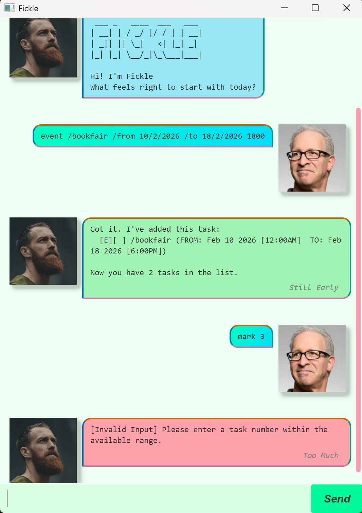

# Fickle User Guide



**Credits:**
- Background Image - Photo of Gullfoss by [Sarah Thorenz on Unsplash](https://unsplash.com/photos/2ALdMuvRD0w)
- Fickle Chatbot and User Avatar Images: Images generated by ChatGPT

## Quick Overview
Fickle keeps your tasks organized so you can focus on what matters.

- Text-based and ***fast*** to use 🏎️
- **Easy** to learn —  *you can start right away* ✏️ 
- Simple and **clear** commands ✔️ 
-  Keep **ALL** your tasks organised in <ins>one</ins> place 📆

## Important Notes

#### Before jumping in the feature list, here are some key points for your knowledge.

- **ALL** command words are case-insenstive : `list` and `LIST` work the same.
- Words in **UPPER_CASE** are mandatory parameters.
- Words in **[square brackets]** are optional parameters.
- Use exact format for tags in Deadline (`/by`) and Event(`/from`, `/to`). No spaces or uppercase inside the tags.

## Features List

### 1. Adding a Todo task

Adds a simple task without a date/time.

Format: `todo TASK_NAME`

Example: `todo buy groceries`

Note: Duplicate Todo names are **NOT** allowed.

### 2. Adding a Deadline task

Adds a task with a due date/time.

Format: `deadline TASK_NAME /by DATE [time]`

Examples:
- `deadline Assignment1 /by 10/3/2023`: Due at March 10 2023, with default time of 12:00AM.         
- `deadline Assignment1 /by 10/3/2023 2000`: Due at March 10 2023, 8:00PM.

Notes:
- Duplicated deadlines (same name + due date/time) are **NOT** allowed. 
- Date format: `d/M/yyyy` (2/6/2025 or 02/06/2025).
- Time format: `24-hour` (default 00:00 if omitted).

### 3. Adding an Event task

Adds a task with start and end date/time.

Format: `event TASK_NAME /from DATE [time] /to DATE[time]`

Examples:
- `event book fair /from 10/2/2025 /to 20/2/2025`
- `event book fair /from 10/2/2025 1000 /to 20/2/2025`

Notes:
- `End time` cannot be before `start time`.
- Duplicated events (same name + same date/time + end date/time) are **NOT** allowed. 
- Date format: `d/M/yyyy` (2/6/2025 or 02/06/2025).
- Time format: `24-hour` (default 00:00 if omitted).


### 4. Marking a Task

Marks a task at a specifc index as done.

Format: `mark TASK_INDEX`

Example: `mark 1`

Notes:
- Marking an already done task has **no effect**.
- Fickle's task uses **1-based** indexing.
- Task status: `[X]` = done, `[ ]` = not done.

### 5. Unmarking a Task

Unmarks a task at a specifc index as not done.

Format: `unmark TASK_INDEX`

Example: `unmark 1`

Notes:
- Unmarking an unmarked task has **no effect**.
- Fickle's task uses **1-based** indexing.
- Task status: `[X]` = done, `[ ]` = not done.

### 6. Listing all Tasks

Views all tasks with type, status, and date/time info.

Format: `list`

Notes:
- Do not add extra words after `list`.
- Example output: `[T][X] homework` means a Todo task named homework is done.

### 7. Deleting a Task

Deletes a task at a specific index.

Format: `delete TASK_INDEX`

Example: `delete 2`

Notes:
- Deleted tasks **CANNOT** be recovered.
- Fickle's task uses **1-based** indexing.

### 8. Finding tasks by name

Searches tasks by keyword (case insensitive and partial match)

Format: `find KEYWORD`

Example: `find book`

Notes:
- Returns both tasks with names `return BooK` and `bookfair` for example above.
- `KEYWORD` cannot be empty.

### 9. Searching tasks by date

Views tasks scheduled for a specific date.

Format: `schedule DATE`

Example: `schedule 3/10/2025`

Notes:
- Display all `Deadline` tasks due on the specific date and `Event` tasks that include the date.
- `Todo` tasks are not included.

### 10. Getting Help

Views help for a specific or all commands

Formats:
- `help`
- `help COMMAND_NAME`

Command names supported :
`todo`, `deadline`, `event`, `mark`, `unmark`, `list`, `delete`, `find`, `schedule`, `help`, `bye`

### 11. Exiting the chatbot

Ends the chatbot session and closes the windows automatically.

Format: `bye`

Note: Do not add extra words after `bye`.

## Installation Steps

1. Download the latest `.jar` release from [here](https://github.com/kelv5/ip/releases).
2. Navigate `cd` to the folder where you saved the **JAR** file.
3. **Run** Fickle using:
```bash
java -jar fickle-v0.4.jar 
```
